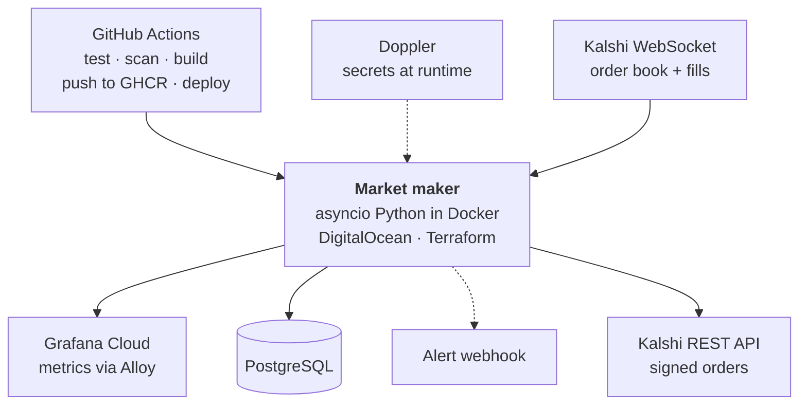
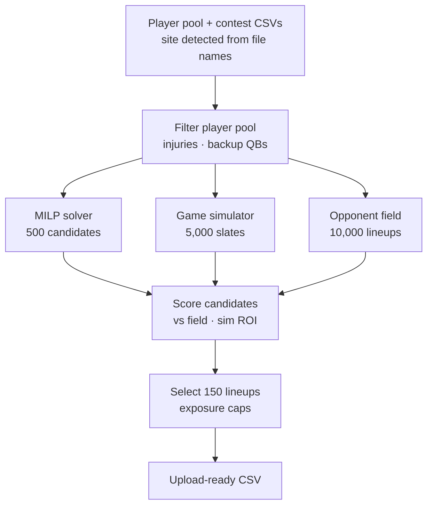

# Hello, I'm Kel!

I'm a senior software engineer with 12 years of experience building the systems that keep software reliable: test infrastructure, CI/CD pipelines and observability. These days I'm focused on backend engineering: event-driven services, PostgreSQL, and the infrastructure that runs them.

## Projects

### [Kalshi Market Maker](https://github.com/kel-reid/Kalshi-Trading-Bot)

I built and run a live algorithmic market maker for Kalshi prediction markets. It quotes both sides of sports contracts using Avellaneda-Stoikov pricing and trades real capital, so I designed it with safety and recovery first.

- **Async, event-driven service:** asyncio Python handles a WebSocket order-book feed and REST order execution concurrently; order history and state live in PostgreSQL.
- **Risk controls:** session loss and fee limits, inventory caps, a pause on fast price moves, and a kill switch that withdraws all quotes on crash or shutdown. The process won't exit until the exchange confirms the cancellations.
- **Infrastructure as code:** Terraform provisions an isolated VPC and a firewall that limits outbound traffic to DNS, HTTP/S and NTP. CI validates it and scans it with tfsec.
- **Secrets:** Doppler injects API keys and RSA signing keys at runtime, so nothing sensitive is written to the host's disk.
- **Containers:** multi-stage Docker builds, a non-root runtime user, and database and metrics ports bound to localhost only.
- **CI/CD:** GitHub Actions runs tests with coverage, Terraform checks and security scans, publishes images to GHCR, and deploys to the server.
- **Observability:** Prometheus metrics (API latency, inventory, P&L) are scraped by Grafana Alloy into Grafana Cloud, with webhook alerts.

`Python (asyncio)` `PostgreSQL` `Docker` `Terraform` `GitHub Actions` `Prometheus` `Grafana` `Doppler` `DigitalOcean`

### [DFS Optimizer](https://github.com/kel-reid/DFS-Optimizer)

An optimization and Monte Carlo engine I built to generate 150-lineup NFL daily fantasy portfolios for FanDuel and DraftKings.

- Generates 500 candidate lineups with an integer-programming solver (PuLP/CBC) under salary-cap, stacking, exposure and uniqueness constraints.
- Simulates 5,000 slates with skewed player distributions and correlated team-level shocks in NumPy, plus a field of 10,000 opponent lineups, then scores every candidate against that field.
- Selects the 150 lineups with the best simulated return, within per-position exposure caps.
- Detects the target site from its input files and runs the same pipeline for both; tested with pytest; containerized.

`Python` `NumPy` `pandas` `PuLP` `pytest` `Docker` 

## Skills

<table>
  <thead>
    <tr>
      <th align="left" valign="top">Backend &amp; Data</th>
      <th align="left" valign="top">Infrastructure &amp; Delivery</th>
      <th align="left" valign="top">Observability</th>
      <th align="left" valign="top">Testing &amp; Quality</th>
      <th align="left" valign="top">Also</th>
    </tr>
  </thead>
  <tbody>
    <tr>
      <td valign="top">
        Python (asyncio) 
        PostgreSQL 
        REST &amp; WebSocket APIs 
        NumPy, pandas
      </td>
      <td valign="top">
        Docker / Compose 
        Terraform 
        GitHub Actions 
        CircleCI 
        Doppler
      </td>
      <td valign="top">
        Prometheus 
        Grafana 
        Datadog 
        Sentry
      </td>
      <td valign="top">
        pytest 
        Playwright 
        Cypress 
        Jest 
        XCTest / XCUITest 
        JUnit / Espresso
      </td>
      <td valign="top">
        TypeScript, React, GraphQL 
        Swift, Kotlin 
        Claude Code, MCP
      </td>
    </tr>
  </tbody>
</table>

## Get in touch

I'm always happy to talk backend systems, reliability or testing. Find me on [LinkedIn](https://www.linkedin.com/in/kel-reid/).
